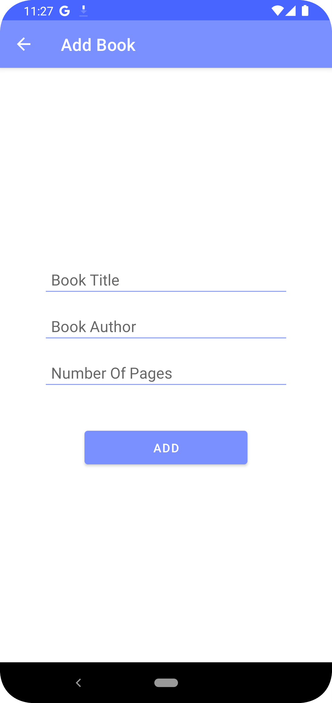

# Book Library Android App

The Book Library Android App is a simple application that allows users to add, view, update, and delete books in their personal library. Users can enter the book title, author, and number of pages, and the data will be stored using SQLite for offline access. The app also includes a RecyclerView to display the list of books with the ability to update and delete individual entries.

## Screenshots

   

## Features

- Add new books to your library with title, author, and number of pages.
- View the list of books in your library using a RecyclerView.
- Update the details of a book.
- Delete books from your library.

## Technologies Used

- Java: The main programming language used for Android app development.
- SQLite: Used as the local database to store and manage the book data.
- Android Studio: The IDE used for Android app development.

## How to Use

1. Launch the app on your Android device.
2. Click on the floating action button (FAB) to add a new book.
3. Enter the book title, author, and number of pages in the provided fields.
4. Click the "Save" button to add the book to your library.
5. The list of books will be displayed in the RecyclerView.
6. To update a book's details, click on the book in the list. It will take you to the update screen.
7. Make the necessary changes and click the "Update" button.
8. To delete a book, swipe the book entry left or right in the RecyclerView.

